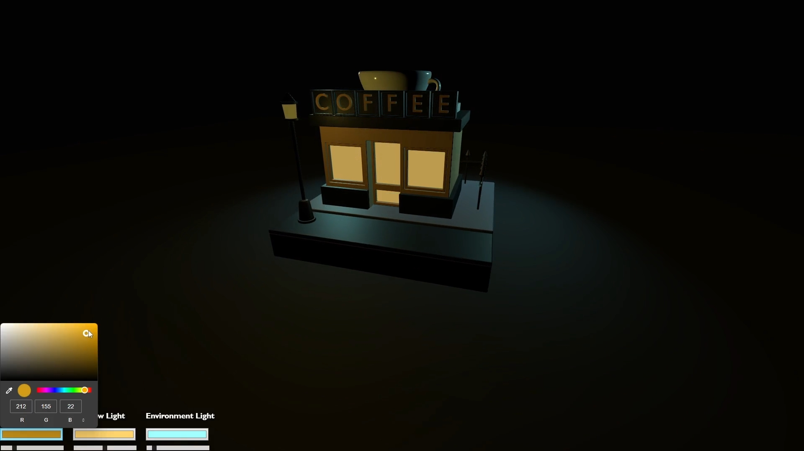
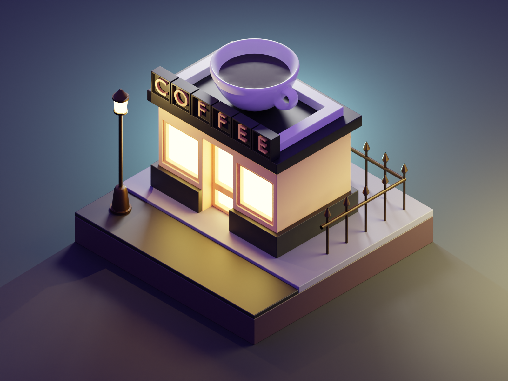

<h1 align="center">THREE.js Interactive Isometric</h1>

> **A small interactive 3D isometric website built using the JavaScript Three.js framework.**
>
> *Click on the photo below for a video preview:*

[](./static/VideoPreview.mp4)

***

<h3 align="center"><strong>Set up</strong></h3>

> **This project can be used as a demonstration of some features of the Three.js framework.** The topics covered in the project:
> - Import and positioning of 3D models;
> - Work with light (point Light, spotLight);
> - Working with emission mesh materials;
> - Simple scene animation;
> - Scene control using HTML tags (Interactive).
>

**To <a href="https://threejs.org/docs/index.html#manual/en/introduction/Installation">install,</a> download <a href="https://nodejs.org/">Node.js</a> and run the following commands in a terminal:**
```bash
npm install --save three

npm install --save-dev vite

npx vite    
```
**If everything went well, you'll see a URL like http://localhost:5173 appear in your terminal,** and can open that URL to see your web application.

***


[](https://www.youtube.com/watch?v=0TzjpR3pdpk)